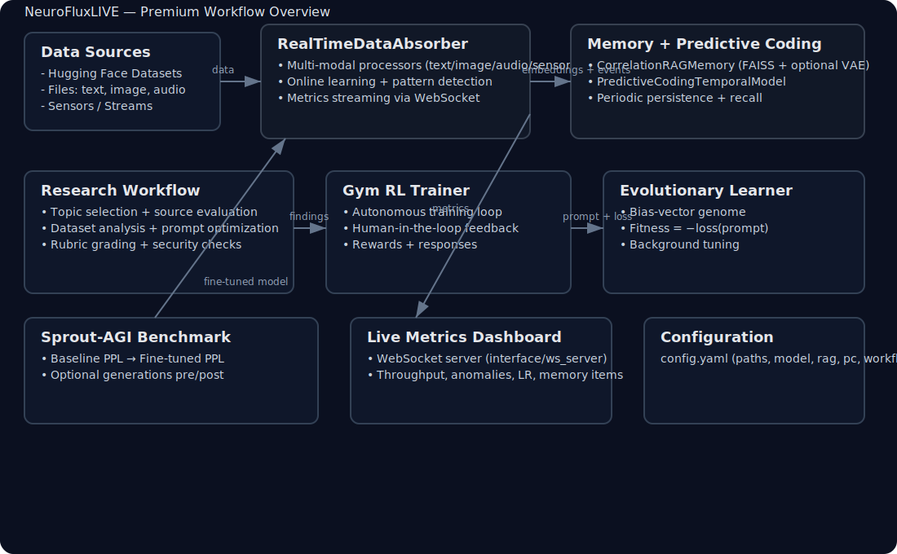
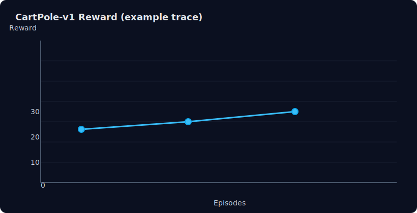
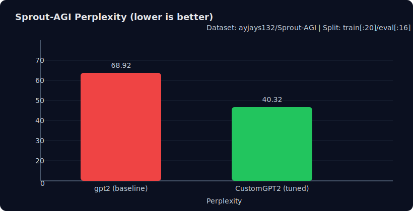

# 🚀 NeuroFluxLIVE Premium Workflow

NeuroFluxLIVE unifies research tooling, reinforcement learning, and evolutionary search so a language model can keep learning while answering questions in real time. The premium workflow provides a single CLI entry point and a set of composable Python APIs to run full‑stack experiments: research → training → evaluation → RL → evolutionary tuning.



## 🌐 Installation

```bash
# 1) Python 3.10+ recommended
python -V

# 2) Create and activate a virtual environment
python -m venv .venv
source .venv/bin/activate

# 3) Install dependencies
pip install --upgrade pip
pip install -r requirements.txt

# 4) Install the package in editable mode (exposes console script "premium_workflow")
pip install -e .
```

- Required runtimes: CPU works; CUDA highly recommended for training speed.
- Key deps: `torch`, `transformers`, `datasets`, `faiss-cpu`, `opencv-python`, `soundfile`, `scikit-learn`, `websockets` (see `pyproject.toml`).

## ⚙️ Quick Start

Run the full premium pipeline with your preferred model and prompt:

```bash
premium_workflow --model ayjays132/NeuroReasoner-1-NR-1 --prompt "The future of AI"
```

This performs the research demo, optionally runs a Gym RL training loop, and finishes with an evolutionary learner pass that adapts the LM head bias to reduce prompt loss, then launches background evolutionary tuning.

### Programmatic quick start

```python
from premium_workflow import run_premium_workflow

run_premium_workflow(prompt="The sky is blue because")
```

## 🧩 Configuration

The realtime bootstrap and the RL workflow read defaults from `config.yaml`:

```yaml
paths:
  data_root: "./data"
  db_path: "realtime_learning.db"
training:
  learning_rate: 0.0001
  buffer_size: 10000
  batch_size: 32
  update_frequency: 100
  adaptation_threshold: 0.7
model:
  embed_dim: 256
rag:
  memory_budget: 50000
pc:
  context_window: 32
workflow:
  absorber: true
  rl_trainer: true
  evaluator: true
```

- `workflow.absorber` controls attachment of `CorrelationRAGMemory` + `PredictiveCodingTemporalModel` through the realtime absorber.
- `training.*` are live‑update parameters for the absorber’s online learner.

## 🧪 Research Demo

The research workflow integrates topic selection, source evaluation, dataset analysis, and prompt optimization, and runs a small training + evaluation example.

```python
from premium_workflow import run_research_workflow
run_research_workflow()
```

Key modules involved:
- `research_workflow.TopicSelector`: topic suggestion and question validation
- `digital_literacy.SourceEvaluator`: credibility checks for sources
- `analysis.dataset_analyzer`: dataset statistics and visualization helpers
- `analysis.prompt_optimizer` and variants: prompt search strategies

## 🕹️ CartPole Reinforcement Learning

Run an autonomous RL loop with optional realtime absorption and rubric feedback:

```bash
python - <<'PY'
from premium_workflow import run_autonomous_pipeline
import yaml
with open('config.yaml') as f:
    cfg = yaml.safe_load(f)['workflow']
    cfg['absorber'] = False   # disable absorber for minimal demo
    cfg['evaluator'] = False  # disable rubric feedback
run_autonomous_pipeline('CartPole-v1', cfg)
PY
```

Example reward trace:



## 🧬 Evolutionary Learner

The learner mutates the model’s LM head bias as a compact genome and searches for deltas that lower prompt loss.

```python
from premium_workflow import run_evolutionary_learner
run_evolutionary_learner(
    "Explain evolution.",
    model_name="ayjays132/NeuroReasoner-1-NR-1",
    generations=2,
    population=10,
)
```

- Fitness = −loss(prompt). Best genome is applied to the model and a background evolutionary system is launched via `integrate_evolutionary_learning` for continuous self‑improvement.

## 📊 Sprout‑AGI Benchmark

Measure baseline perplexity, fine‑tune for one epoch on `ayjays132/Sprout-AGI`, and compare generations.

```bash
premium_workflow --sprout-benchmark --model gpt2 --prompt "The future of AI"
```

Reference metrics from `docs/benchmarks.md` (small subsplits):

| Model | Perplexity (train[:20]/eval[:16]) |
| --- | --- |
| gpt2 (baseline) | 68.92 |
| ayjays132/CustomGPT2Conversational (tuned) | 40.32 |



Note: Your exact numbers will vary by hardware, seed, tokenizer settings, and batch sizes. The CLI also exposes a self‑contained benchmark path that reproduces fine‑tuning in-place and saves the best checkpoint to `./sprout_benchmark/best_model` when it improves perplexity.

Programmatic API:

```python
from premium_workflow import benchmark_sprout_agi
base_ppl, tuned_ppl, base_txt, tuned_txt = benchmark_sprout_agi(
    model_name="gpt2",
    train_samples=32,
    eval_samples=16,
    prompt="The future of AI",
)
```

## 🧠 Realtime Absorption + Memory

- `RealTimeDataAbsorber`: multi‑modal processors (text/image/audio/sensor), online self‑supervised updating, anomaly/pattern/drift detection, metrics streaming to a WebSocket dashboard.
- `CorrelationRAGMemory`: FAISS‑backed retrieval with optional `VAECompressor` for embedding compression and on‑disk persistence; supports reconstruction when reloading.
- `PredictiveCodingTemporalModel`: observes embedding streams to improve sequence prediction.

Bootstrap the realtime stack with live metrics:

```bash
python main.py --config config.yaml
```

- On start, it attaches `CorrelationRAGMemory` and `PredictiveCodingTemporalModel`, brings up the WebSocket server (`interface/ws_server.py`), and begins absorption.
- Use the `data_root` folder to drop sample files; the watcher ingests them automatically.

## 🔧 CLI Reference

```text
premium_workflow [--gym] [--benchmark CartPole-v1] [--sprout-benchmark] \
                 [--model MODEL_ID] [--prompt PROMPT] [--evolve]

--gym                Run the Gym RL trainer (default benchmark: CartPole-v1)
--benchmark          Choose Gym environment (with --gym)
--sprout-benchmark   Run Sprout‑AGI fine‑tuning benchmark
--model              HF model for benchmark/evolution (default: gpt2)
--prompt             Optional prompt to compare generations
--evolve             Run evolutionary learner demo
```

## ✅ Tested Environment Notes

- CPU‑only works for demos; GPU recommended for benchmarks and RL.
- A compatibility shim maps `torch.uint64` to `torch.int64` to avoid `safetensors` import errors on older Torch builds.
- If FAISS GPU is installed, it will be used by `faiss` automatically; `faiss-cpu` is included by default.

## 🧯 Troubleshooting

- PyTorch dtype error on `safetensors`: The workflow injects a shim in `premium_workflow.py` to prevent `AttributeError` when `torch.uint64` is missing.
- CUDA OOM: Reduce `train_samples`, `eval_samples`, or batch sizes; consider using a smaller model like `distilgpt2`.
- FAISS import issues: Ensure `faiss-cpu` (default) is installed or install a matching CUDA build.
- OpenCV/headless: For servers without a display, ensure `opencv-python` is installed (already in deps) and avoid GUI calls.

## 🔒 Licensing

Research use only. See `LICENSE`.

## 🙌 Acknowledgements

- Hugging Face `transformers` and `datasets`
- FAISS (Facebook AI Similarity Search)
- OpenAI Gym‑style RL environments
- scikit‑learn, OpenCV, SoundFile, and friends
